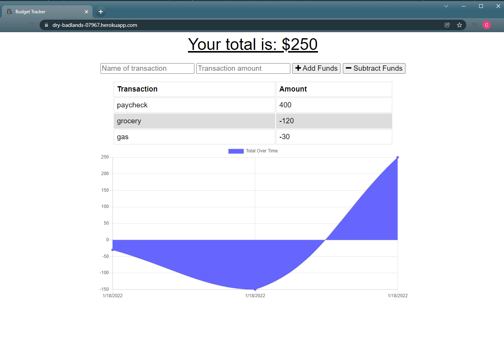

  
# Progressive-Budget  

## Table of Contents 
[Description](#description)  
[Installation](#installation)  
[Technologies](#technologies)  
[Usage/Link](#usage/link)  
[License](#licensing)  
[Questions](#questions)  

## Installation
After cloning this repository, install all dependencies by typing npm install in the terminal. Run npm start to start the application locally.

## Description
This is a budget tracker with offline functionality.  

## Technologies
Node.js  
express  
MongoDB  
Mongoose  
PWA  

## Usage
You can access the deployed application here: https://dry-badlands-07967.herokuapp.com/.  

After navigating to the application through the link, users open to the home page.
  

Users can add or subtract funds by adding an amount and name for the transaction. The app keeps track of expenses using a chart. This app can also be installed as a Progressive web app and function without an internet connection.  

## Licensing
Licensed under [MIT license](LICENSE).  

## Questions
Email at whitcam20@gmail.com

